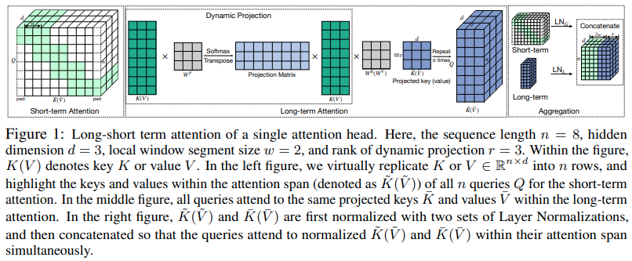

</img>

## Long-Short Transformer

Implementation of <a href="https://arxiv.org/abs/2107.02192">Long-Short Transformer</a>, combining local and global inductive biases for attention over long sequences, in Pytorch

## Install

```bash
$ pip install long-short-transformer
```

## Usage

```python
import torch
from long_short_transformer import LongShortTransformer

model = LongShortTransformer(
    num_tokens = 20000,
    dim = 512,
    depth = 6,             # how deep
    heads = 8,             # number of heads
    dim_head = 64,         # dimension per head
    max_seq_len = 1024,    # maximum sequence length
    window_size = 128,     # local attention window size
    r = 256                # like linformer, the sequence length is projected down to this value to avoid the quadratic, where r << n (seq len)
)

x = torch.randint(0, 20000, (1, 1024))
mask = torch.ones(1, 1024).bool()

logits = model(x, mask = mask) # (1, 1024, 20000)
```

For the autoregressive case, you will have to also supply the `segment_size` and set `causal` to `True`

```python
import torch
from long_short_transformer import LongShortTransformer

model = LongShortTransformer(
    num_tokens = 20000,
    dim = 512,
    depth = 6,             # how deep
    heads = 8,             # number of heads
    dim_head = 64,         # dimension per head
    causal = True,         # autoregressive or not
    max_seq_len = 1024,    # maximum sequence length
    window_size = 128,     # local attention window size
    segment_size = 16,     # sequence is divided into segments of this size, to be projected down to r
    r = 1                  # paper claimed best results with segment to r of 16:1
)

x = torch.randint(0, 20000, (1, 1024))
mask = torch.ones(1, 1024).bool()

logits = model(x, mask = mask) # (1, 1024, 20000)
```

You can test the autoregressive on enwik8 with

```bash
$ python train.py
```

## Citations

```bibtex
@misc{zhu2021longshort,
    title   = {Long-Short Transformer: Efficient Transformers for Language and Vision}, 
    author  = {Chen Zhu and Wei Ping and Chaowei Xiao and Mohammad Shoeybi and Tom Goldstein and Anima Anandkumar and Bryan Catanzaro},
    year    = {2021},
    eprint  = {2107.02192},
    archivePrefix = {arXiv},
    primaryClass = {cs.CV}
}
```
